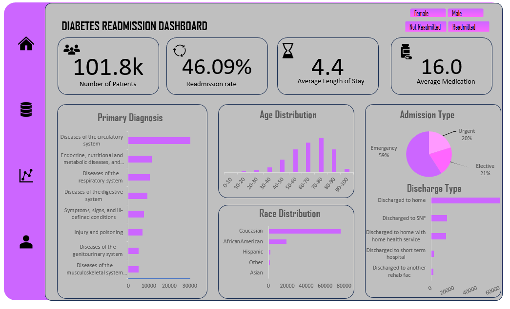
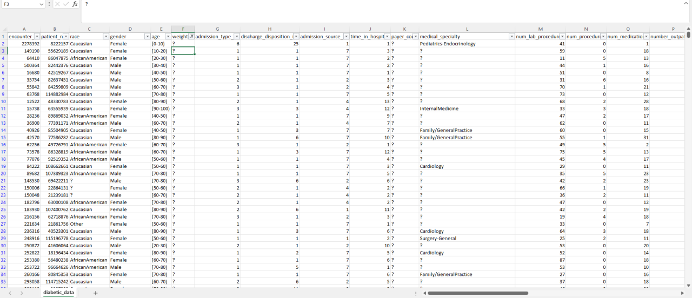
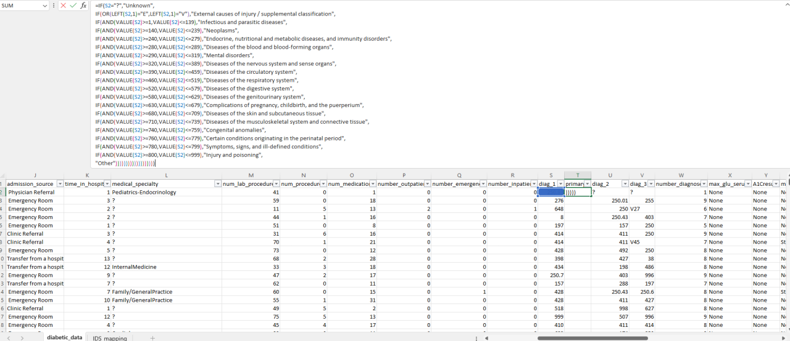

# Diabetes-Readmission
Excel dashboard analyzing diabetes readmission trends, demographics, and hospital outcomes
  

## Overview  
This project analyzes hospital admissions and readmissions to uncover patterns in patient demographics, primary diagnoses, and post-discharge outcomes. The insights inform strategies for improving care delivery and reducing diabetes readmission rates.  

---

## Screenshot of Dashboard  

  
*Figure 1: Overview of patient readmission metrics.*

---

## Project Objective  
The objective of this project is to analyze diabetes admissions and readmissions to:  
- Identify patterns in demographics, admission types, and primary diagnoses.  
- Understand factors influencing readmissions.  
- Provide actionable recommendations to improve patient outcomes, reduce readmission rates, and strengthen healthcare delivery models.  

---

## Dataset Description  
The dataset contains hospital admission records with key information such as:  
- **Patient Demographics:** gender, age and race.  
- **Admission Details:** admission type, admission source, time in hospital.  
- **Diagnosis Information:** primary, secondary and tertiary diagnosis codes.  
- **Discharge Outcomes:** discharge destinations, readmission status.  

---

## Tools Used  
- **Excel** → Data cleaning, analysis, and visualization (pivot tables, charts, dashboards).  

---

## Key Steps  
1. **Data Cleaning**  
  - **Removed irrelevant columns:** `Weight`, `Encounter ID`, and `Payer Code` to focus on meaningful features.  
  - **Cleaned Age Column:** Standardized and corrected invalid or missing age values for consistency.  
  - **Mapped Admission Type and Source IDs:** Updated `Admission Type ID` and `Admission Source ID` according to **ICD-9 (2008)** classification for accurate analysis. Dataset from 2008   
  - **Created Readmission Status:** Derived a new column from the `Readmitted` column to categorize patients as **Readmitted** or **Not Readmitted**.  

2. **Exploratory Data Analysis (EDA)**  
  - Examined admission patterns, demographics, diagnoses, and readmission trends.  
  - Conducted group-level comparisons (e.g., gender, age groups, discharge types).  

3. **Visualization**  
   - Built interactive dashboards and charts in **Excel** to highlight key KPIs, trends, and insights.  

4. **Insight Generation**  
   - Identified high-risk patient groups and factors influencing readmissions.  

5. **Recommendations**  
   - Suggested actionable healthcare interventions to reduce readmission rates and improve patient care.  

---

## Key Insights  

- **Admission Patterns**  
  - Majority of admissions across all patient groups occur through the **emergency department**, indicating a reactive healthcare model.  
  - Patients often seek care only during acute episodes, suggesting suboptimal condition management at home.  

- **Discharge Destinations**  
  - Most patients are discharged home.  
  - A higher proportion of patients in the **"Not Readmitted"** group are discharged to **Skilled Nursing Facilities (SNFs)** or receive **home health services**, highlighting the impact of post-discharge support.  

- **Demographics**  
  - Female patients: **25.7k**  
  - Male patients: **21.2k**  

- **Primary Diagnoses**  
  - **Circulatory system diseases** dominate as the primary diagnosis for both genders.  

- **Readmission Trends**  
  - Readmissions are most frequent in the **60–80 age group**.  
  - **Females:** peak readmissions in **70–80 years**  
  - **Males:** peak readmissions in **60–70 years**  

---

## Recommendations  

1. **Targeted Disease Management**  
   - Prioritize interventions for **circulatory system diseases**, given their prevalence.  

2. **Post-Discharge Care Programs**  
   - Develop specialized programs for older adults (**60–80 years**) to reduce readmission risk.  

3. **Age- and Gender-Specific Monitoring**  
   - Focus on **females aged 70–80** and **males aged 60–70** for enhanced follow-up and monitoring.  

4. **Preventive and Outpatient Care**  
   - Strengthen outpatient services and preventive care to reduce reliance on emergency admissions.  

5. **Structured Follow-Up**  
   - Schedule follow-up appointments **before discharge**.  
   - Ensure a **follow-up visit within 7 days** post-discharge to reassess patient conditions and adjust care plans.  

6. **Gender-Sensitive Care Planning**  
   - Incorporate gender-specific factors into **disease management**, rehabilitation, and care planning.  
